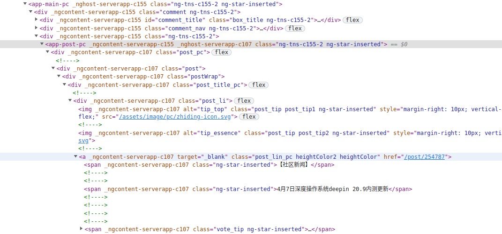
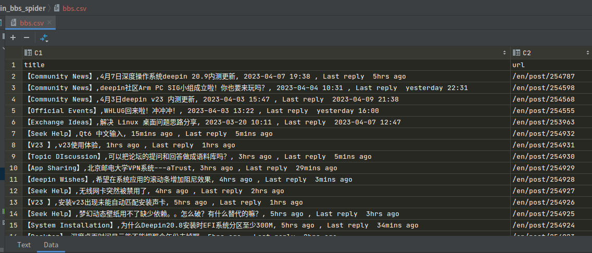
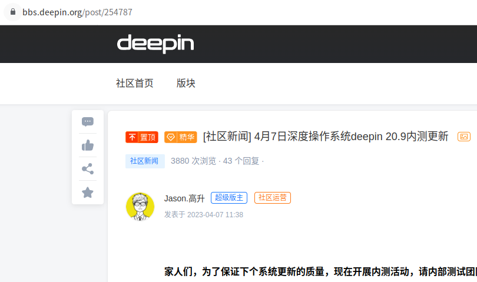
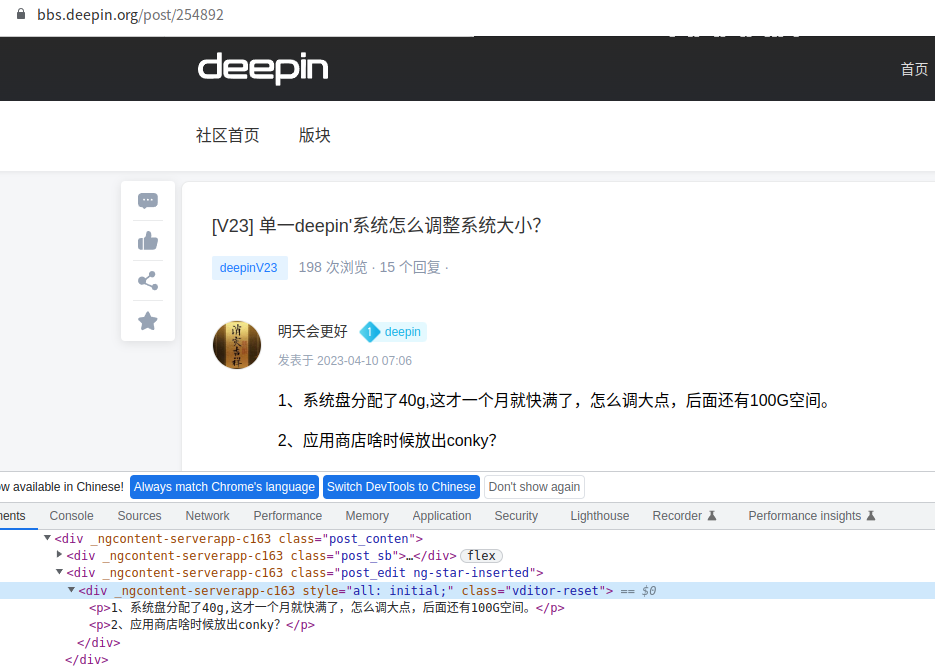
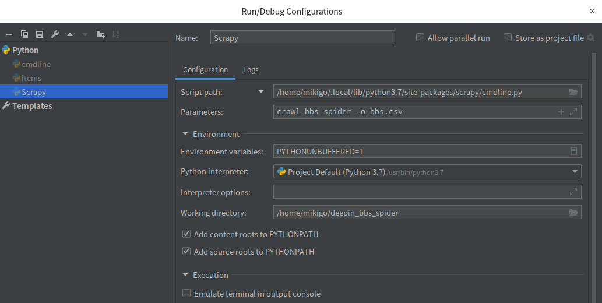
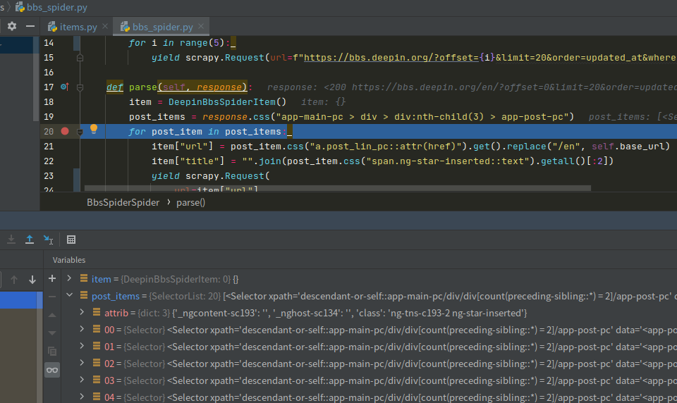

comments: true
# Scrapy

```shell
# =============================
# Author : mikigo
# Time   : 2023/3/17
# =============================
```

## 1、简介

Scrapy 是现阶段 Python 社区最流行的爬虫框架，它能够极大的简化爬虫的编写难度，简化代码。

当然它不是 Python 社区唯一的爬虫框架，但我认为是现阶段最好用的爬虫框架。

经常用同学问，为啥要用 Scrapy，我用 requests 不可以吗？

我觉得这样解释：

- 不是一个类型

requests 最多算是爬虫工具，不同的人写出来的爬虫代码都不同，重复代码还多，而且对于一些高级的应用场景，如：多线程处理、异步处理、持久化等，估计没几个人能处理的很完美，最后爬下来的数据还要找一堆工具来解析处理，比如：re、BeautifulSoup、lxml等，属实让人挠头；

而爬虫框架通常提供了简单的配置，使用很少的代码就能实现复杂的功能，代码量少了，而且底层也为你处理了很对问题，框架在解析数据也有自带的方案，所以你只需要按照框架所定义好的规范，就可以轻松完成各种任务；

- 不是一个圈子

Scrapy 主要用于数据爬取，所以说它是爬虫框架，你说用它来做一些 POST 请求发个数据啥的，咱们貌似没这么用过；

而 requests 只要是网络接口请求都能用，爬数据也可以，但你要说爬数据有多强呢，就要看使用的人有多强了；

总结：

- 新手、老司机做小任务，用哪个都无所谓，用框架的话会轻松很多；
- 新手做大任务，用框架，不要想，省时省力；
- 老司机做大任务，用工具可以做，就是有点麻烦；用框架也能搞，但是不能秀出你的实力；

## 2、安装

系统环境：deepin

```console
sudo pip3 install Scrapy

```

## 3、创建项目

咱们就爬取 deepin 论坛的贴子，找找感觉；

创建一个爬虫项目名为：deepin_bbs_spider

```console
cd ~
scrapy startproject deepin_bbs_spider
```

工程目录结构：

```console
deepin_bbs_spider
├── deepin_bbs_spider
│   ├── __init__.py
│   ├── items.py  # 数据类型定义
│   ├── middlewares.py  # 中间件
│   ├── pipelines.py  # 数据管道
│   ├── settings.py  # 配置项
│   └── spiders  # 放爬虫脚本的目录
│       └── __init__.py
└── scrapy.cfg  # 部署配置文件
```

## 4、开始写爬虫

在 `~/deepin_bbs_spider/deepin_bbs_spider/spiders` 目录下写我们的爬虫脚本文件，创建一个爬虫，目标是爬取论坛里面帖子内容：

```python
# bbs_spider.py

import scrapy

class BbsSpiderSpider(scrapy.Spider):
    name = "bbs_spider"
    allowed_domains = ["bbs.deepin.org"]
    start_urls = ["https://bbs.deepin.org/?offset=0&limit=20&order=updated_at&where=&languages=zh_CN#comment_title"]

    def parse(self, response):
        post_items = response.css("app-main-pc > div > div:nth-child(3) > app-post-pc")
        for post_item in post_items:
            url = post_item.css("a.post_lin_pc::attr(href)").get()
            title = post_item.css("span.ng-star-inserted::text").getall()
            print("url:", url)
            print("title", title)
```

啥也不说，先跑起来试试：

```console
cd ~/deepin_bbs_spider
scrapy crawl bbs_spider
```

跑完之后，终端就会有输出爬取到的帖子信息：


你先别管其他的，至少咱们能爬到数据了，接下来咱们慢慢介绍上面这些代码是怎么来的~；

## 5、逻辑讲解

### 5.1、生成爬虫模板

看了上面的示例，有同学肯定要问，你咋知道要写个类呢，你咋知道要写个 `parse` 函数呢？

我确实不知道，`scrapy` 也知道咱们不知道，所以做了个工具自动生成：

```console
scrapy genspider <spider name> <spider url>
```

用子命令 `genspider`，后面加爬虫的名称（spider name），再加要爬取地址（url），就可以在 `spiders` 目录下自动生成一个 `py` 文件；

比如，咱们像这样：

```console
scrapy genspider bbs_spider "https://bbs.deepin.org"
```

执行之后就会自动生成 `py` 文件：

```python
import scrapy

class BbsSpiderSpider(scrapy.Spider):
    name = "bbs_spider"
    allowed_domains = ["bbs.deepin.org"]
    start_urls = ["https://bbs.deepin.org"]

    def parse(self, response):
		pass
```

简单讲解一下：

- 爬虫类是要继承 `scrapy.Spider` 的，这个不要去动，知道继承就对了；
- 类变量 `name` 是爬虫的名称，这玩意儿就是个代号，你想改成王大锤都行，一般赖得去管；
- 类变量 `allowed_domains` 爬虫域名；
- 类变量 `start_urls` 爬虫目标地址，可以给多个；
- 实例方法 `parse(self, response)` 也是固定写法，函数名称最好不动，参数名称不能改，因为是 scrapy 返回的一个 Selector 对象；

这里面核心逻辑就是在 `parse` 函数里面去写，你可以理解成 `response` 就是返回的页面信息，你只需要在这里面去提取想要的数据就好了；

`response` 提供一些方法，能够很方便的进行页面信息提取；

### 5.2、爬虫编写方法

前面说到爬虫脚本里面 `response`，它是我们编写代码的核心，所有的数据提取都从这里来；

下面我们讲讲数据的提取方法，这里多嘴一句，我默认大家都是有一点前端基础的，不然下面部分内容可能需要去学习下 html、css相关知识；

首先来讲 css 提取方法，css 的解析是非常灵活的，先用 F12 看下 html 源码：


可以看到所有的帖子都在 `app-post-pc` 标签下面，咱们可以这样写：

```python
def parse(self, response):
    post_items = response.css("app-post-pc")
```

如果你是使用右键复制的选择器，可能是一个很长的表达式，不太优雅也不利于维护，我个人不太建议使用直接复制表达式，而应该通过观察自己写；

这样的话，`post_items` 就获取到了所有帖子的 `app-post-pc` 标签，再看下 `app-post-pc` 标签下都有啥：



可以看到在 `app-post-pc` 标签下还有 a 标签，保存了帖子的详情地址(`post_url`)，然后在 a 标签下的 span 标签保存了帖子的类型和标题(`title`)，因此咱们想办法把这两个拿到：

```python
def parse(self, response):
    post_items = response.css("app-post-pc")
    for post_item in post_items:
        url = post_item.css("a.post_lin_pc::attr(href)").get()
        title = post_item.css("span.ng-star-inserted::text").getall()
        print("url:", url)
        print("title", title)
```

先用 for 循环把 `post_items` 里面每个 `Selector` 对象里面的 `url` 和 `title` 拿到；

`post_item` 就是单个的 `Selector` 对象，我们在它的基础上再通过 css 方法获取到我们想要的数据；（也可以使用 Xpath 技术获取）

- `url` 是在 a 标签里面的 href 属性里面，因此：

```python
post_item.css("a.post_lin_pc::attr(href)").get()
```

表达式里面的 `::attr(href)` 这部分是 Scrapy 特有的，`::` 表示取值，`attr(href)` 表示通过 `href` 属性取值；

`get()` 方法表示取第一个值，`getall()` 方法表示取所有的值；（也兼容老版本的 `extract_first()` 和 `extract()` 方法，意思是对应一样的，不过明显`get()` 这种可读性更好更易于理解。）

- `title` 在 span 标签里面：

```python
post_item.css("span.ng-star-inserted::text").getall()
```

`text` 也是 Scrapy 特有的，表示把标签的文本取出来；

非常好理解对吧，只要你稍微有点前端知识，就能够轻松把表达式写出来；

### 5.3、获取数据

前面例子是将获取到的数据打印出来，实际业务里面我们肯定是需要将数据保存下来的；

首先我们在 `items.py` 里面定义数据类型：

```python
# items.py

import scrapy

class DeepinBbsSpiderItem(scrapy.Item):
    # define the fields for your item here like:
    url = scrapy.Field()
    title = scrapy.Field()
```

写法非常简单，统一使用 `scrapy.Field()` 来定义就行了；

然后，回到爬虫脚本里面：

```python
import scrapy
from deepin_bbs_spider.items import DeepinBbsSpiderItem

class BbsSpiderSpider(scrapy.Spider):
    ... # 省略部分代码

    def parse(self, response):
        item = DeepinBbsSpiderItem()
        post_items = response.css("app-post-pc")
        for post_item in post_items:
            item["url"] = post_item.css("a.post_lin_pc::attr(href)").get()
            item["title"] = post_item.css("span.ng-star-inserted::text").getall()
            yield item
```

将 `items.py` 里面的 `DeepinBbsSpiderItem` 导进来，实例化一个对象，然后将获取到的数据复制给这个对象，使用 `item["url"]` 这种给字典添加的方式，注意要和 `items.py` 里面定义的字段名称保持一致；

最后，使用 `yield` 将数据返回出来就行了；

将数据写入到 csv 文件里面：

```console
scrapy crawl bbs_spider -o bbs.csv
```

`-o` 表示导出数据，执行后，查看 bbs.csv 文件：



这样就将爬取到的数据保存到了一个 csv 文件；

### 5.4、处理数据

在爬虫脚本里面获取到原始数据之后，我们还有可能会拿数据做进一步处理，比如还想写入数据库、写入 Excel等等；

这些进一步的操作，我们通常是在数据管道 `pipelines.py` 里面来处理：

```python
class DeepinBbsSpiderPipeline:
    def process_item(self, item, spider):
        return item
```

这里的 `item` 就是每一条数据；

比如，你想写入 ` MySQL`数据库（首先要确保数据库表、字段等正常）：

```python
import pymysql

class DeepinBbsSpiderPipeline:

    def __init__(self):
        # 在构造函数里面创建数据库连接和游标
    
    def open_spider(self, spider):
        # open_spider 是这个管道开始时要执行的；这里可以不要
    
    def close_spider(self, spider):
        # close_spider 写入关闭数据库的代码
    
    def process_item(self, item, spider):
        # 在这里做写入数据库的动作
        return item 
```

在上面注释里面写了写入数据库的编写逻辑，由于我们主要想讲解数据管道的操作逻辑，数据库的代码数据基本操作，就不做详细代码示例了，往上搜 `pymysql` 的使用很多，按照注释的逻辑，对号入座就行了；

如果想写入 Excel 表格逻辑是一样的，也可以表格和数据库同时写入，在 `pipelines.py` 里面再定义一个管道类就行了；

注意，数据管道逻辑写完之后，要在 `settings.py` 里面修改配置：

```python
ITEM_PIPELINES = {
    "deepin_bbs_spider.pipelines.DeepinBbsSpiderPipeline": 300,
    # "deepin_bbs_spider.pipelines.XxxxPipeline": 2,
}
```

`ITEM_PIPELINES` 是一个字典，key 是数据管道，value 是一个数字；

value 主要用于多个管道排序的，因为在 `pipelines.py` 里面可以定义多个数据管道类，它们执行的先后顺序由 value 来控制，数字越小越先执行；

如果你就一个数据管道类，这个 value 给多少都无所谓；

另外提醒，在 `process_item()` 最后一定要 `return item `，不然存在多个数据管道的时候，后执行的数据管道就拿不到数据了；

好，配置完之后，就可以再次执行了；

### 5.5、从下层页面解析数据

这部分内容相对来讲是难点，搞懂了这部分，就几乎能处理对大部分数据爬取了；

来，开始燥起来~~

前面我们获取到了帖子的 `url` 和 `title`，有同学可能要问了，这个帖子的正文内容哪里；

正文内容在帖子的 `url` 里面，如果我们要同时获取帖子的正文内容，就需要做以下处理；



#### 5.5.1、回调逻辑

首先，前面获取的 `url` 不是一个完整的链接，咱们需要稍微处理以下：

```python
class BbsSpiderSpider(scrapy.Spider):
    
    base_url = "https://bbs.deepin.org"

    def parse(self, response):
        item = DeepinBbsSpiderItem()
        post_items = response.css("app-post-pc")
        for post_item in post_items:
            item["url"] = post_item.css("a.post_lin_pc::attr(href)").get().replace("/en", self.base_url)
	# 省略部分代码
```

我们前面获取的 `url` 是这样的: `/en/post/254787` ，因此做一个替换处理；

然后，咱们拿着这个 `url` 继续做请求：

```python
class BbsSpiderSpider(scrapy.Spider):
    
    base_url = "https://bbs.deepin.org"

    def parse(self, response):
        item = DeepinBbsSpiderItem()
        post_items = response.css("app-post-pc")
        for post_item in post_items:
            item["url"] = post_item.css("a.post_lin_pc::attr(href)").get().replace("/en", self.base_url)
            yield scrapy.Request(
                url=item["url"], 
                callback=self.post_parse, 
                cb_kwargs={"item": item}
            )

    def post_parse(self, response, **kwargs):
        item = kwargs.get("item")
```

这里需要用 `yield` 返回并构造 scrapy.Request 对象，传入三个参数：

- url 就是下层页面的地址；

- callback 传入回调函数对象，因为 `parse()` 这个函数是处理当前页面的逻辑，下层页面就不能在这个函数里面继续处理了，而是要新写一个函数来处理；

  写法和 `parse()` 类似，函数名可以自己定， 参数仍然是 response 对象；

  注意，参数传入是 `callback=self.post_parse`，后面没有加括号哈，因为我们不是在这里调用函数，是传入函数对象，也就是只要函数名；

- cb_kwargs 是为了给 `post_parse()` 函数传递 item 参数，是一个字典类型，这样在 `post_parse(self, response, **kwargs)` 里面的 `kwargs` 就能拿到 item 的值，咱们后续拿到正文之后，继续组装到 item 里面就行了；

#### 5.5.2、下层页面解析

下层页面的解析，逻辑和前面一样，先看下 html 源码：



获取正文：

```python
    def post_parse(self, response, **kwargs):
        item = kwargs.get("item")
        post_info = response.css("div.post_conten > div.post_edit.ng-star-inserted > div > div > p::text").getall()
```

`post_info` 获取的结果为：

```console
['1、系统盘分配了40g,这才一个月就快满了，怎么调大点，后面还有100G空间。', '2、应用商店啥时候放出conky？']
```

做一个字符串组装：

```python
post_info = "".join(response.css("div.post_conten > div.post_edit.ng-star-inserted > div > div > p::text").getall())
```

这样的话，我们就获取到了正文的数据，添加到 item 对象中：

```python
def post_parse(self, response, **kwargs):
    item = kwargs.get("item")
    post_info = "".join(response.css("div.post_conten > div.post_edit.ng-star-inserted > div > div > p::text").getall())
    item["post_info"] = post_info
    yield item
```

注意，在 `items.py` 中把新的字段也添加上：

```python
# items.py

class DeepinBbsSpiderItem(scrapy.Item):
    ...
    post_info = scrapy.Field()
```

最后，跑一下爬虫；

#### 5.5.3、多层数据传递问题

到目前位置，完整的爬虫脚本：

```python
import scrapy
from deepin_bbs_spider.items import DeepinBbsSpiderItem

class BbsSpiderSpider(scrapy.Spider):
    name = "bbs_spider"
    allowed_domains = ["bbs.deepin.org"]
    start_urls = ["https://bbs.deepin.org/?offset=0&limit=20&order=updated_at&where=&languages=zh_CN#comment_title"]
    base_url = "https://bbs.deepin.org"

    def parse(self, response):
        item = DeepinBbsSpiderItem()
        post_items = response.css("app-main-pc > div > div:nth-child(3) > app-post-pc")
        for post_item in post_items:
            item["url"] = post_item.css("a.post_lin_pc::attr(href)").get().replace("/en", self.base_url)
            item["title"] = "".join(post_item.css("span.ng-star-inserted::text").getall()[:2])
            yield scrapy.Request(
                url=item["url"],
                callback=self.post_parse,
                cb_kwargs={"item": item}
            )

    def post_parse(self, response, **kwargs):
        item = kwargs.get("item")
        post_info = "".join(response.css("div.post_conten > div.post_edit.ng-star-inserted > div > div > p::text").getall())
        item["post_info"] = post_info
        yield item
```

使用命令跑一下爬虫：

```console
scrapy crawl bbs_spider -o bbs.csv
```

你会惊奇的发现，怎么所有的 title 和 url 数据相同，开始怀疑自己逻辑是不是写错了；

其实，我们代码逻辑是没问题的，只不过在多层数据传递的过程中，需要特殊处理下，处理方法很简单：

- 导入`from copy import deepcopy`模块，将`cb_kwargs={'item': item}` 更改为 `cb_kwargs={'item': deepcopy(item)`；
- 最后一行代码`yield item` 修改成 `yield deepcopy(item)`就完全 `ok` 了；

改完之后再跑一下，简直完美。

#### 5.5.4、多页面爬取

到现在我们怕去了第一页的数据，那还想爬取后面的页怎么办？

有同学说，好办，`start_urls` 不是一个列表吗，把多个 url 放进去不就完了；

不得不说，这样是可以的，就是不够优雅。

通过仔细观察，我们可以发现一些规律：


在地址中只有 `offset` 参数在变化，第一页是 0，第二页是 1，非常有规律，因此咱们可以动态生成：

```python
class BbsSpiderSpider(scrapy.Spider):
    # start_urls = ["https://bbs.deepin.org/?offset=0&limit=20&order=updated_at&where=&languages=zh_CN#comment_title"]

    def start_requests(self):
        for i in range(5):
            yield scrapy.Request(url=f"https://bbs.deepin.org/?offset={i}&limit=20&order=updated_at&where=&languages=zh_CN#comment_title")
```

使用 `start_requests()` 函数替代 `start_urls`；

在里面写个 for 循环，要爬取多少页填入 `range` 函数就行了，动态生成多个 `scrapy.Request` 对象，注意要用 yield 哦~~

#### 5.5.5、完整的示例

爬虫脚本 `bbs_spider.py`：

```python
from copy import deepcopy

import scrapy

from deepin_bbs_spider.items import DeepinBbsSpiderItem


class BbsSpiderSpider(scrapy.Spider):
    name = "bbs_spider"
    allowed_domains = ["bbs.deepin.org"]
    base_url = "https://bbs.deepin.org"

    def start_requests(self):
        for i in range(5):
            yield scrapy.Request(url=f"https://bbs.deepin.org/?offset={i}&limit=20&order=updated_at&where=&languages=zh_CN#comment_title")

    def parse(self, response):
        item = DeepinBbsSpiderItem()
        post_items = response.css("app-main-pc > div > div:nth-child(3) > app-post-pc")
        for post_item in post_items:
            item["url"] = post_item.css("a.post_lin_pc::attr(href)").get().replace("/en", self.base_url)
            item["title"] = "".join(post_item.css("span.ng-star-inserted::text").getall()[:2])
            yield scrapy.Request(
                url=item["url"],
                callback=self.post_parse,
                cb_kwargs={"item": deepcopy(item)}
            )

    def post_parse(self, response, **kwargs):
        item = kwargs["item"]
        post_info = "".join(
            response.css("div.post_conten > div.post_edit.ng-star-inserted > div > div > p::text").getall()
        )
        item["post_info"] = post_info
        yield deepcopy(item)
```

数据类型 `items.py`：

```python
import scrapy

class DeepinBbsSpiderItem(scrapy.Item):
    # define the fields for your item here like:
    # name = scrapy.Field()
    url = scrapy.Field()
    title = scrapy.Field()
    post_info = scrapy.Field()
```

配置 `settings.py`：（省略了没有启用的配置项）

```python
BOT_NAME = "deepin_bbs_spider"

SPIDER_MODULES = ["deepin_bbs_spider.spiders"]
NEWSPIDER_MODULE = "deepin_bbs_spider.spiders"


# Crawl responsibly by identifying yourself (and your website) on the user-agent
USER_AGENT = "Mozilla/5.0 (X11; Linux x86_64) AppleWebKit/537.36 (KHTML, like Gecko) Chrome/108.0.0.0 Safari/537.36"

# Obey robots.txt rules
ROBOTSTXT_OBEY = True


# Override the default request headers:
DEFAULT_REQUEST_HEADERS = {
   "Accept": "text/html,application/xhtml+xml,application/xml;q=0.9,*/*;q=0.8",
   "Accept-Language": "en",
}

# Set settings whose default value is deprecated to a future-proof value
REQUEST_FINGERPRINTER_IMPLEMENTATION = "2.7"
TWISTED_REACTOR = "twisted.internet.asyncioreactor.AsyncioSelectorReactor"
FEED_EXPORT_ENCODING = "utf-8"
```

如果你自己玩起来有点小问题，可以尝试参考我的代码：https://github.com/mikigo/deepin_bbs_spider

## 6、调试

### 6.1、数据获取调试

在使用 `response.css()` 表达式时，通常我们需要进行调试，看表达式写得对不对，当然你可以通过执行爬虫然后打印数据，但是这种方式有点麻烦；

Scrapy 提供了一个快捷的调试方法，在终端输入：

```console
scrapy shell <scrapy url>
```

`<scrapy url>` 是你要爬取的地址，比如前面我们想获取帖子正文的内容，可以这样调试：

```console
scrapy shell https://bbs.deepin.org/post/254892
```

进入终端交互式，输入：

```console
>>> response.css("div.post_conten > div.post_edit.ng-star-inserted > div > div > p::text").getall()
['1、系统盘分配了40g,这才一个月就快满了，怎么调大点，后面还有100G空间。', '2、应用商店啥时候放出conky？']
```

可以看到返回的结果，如果返回为空，就说明表达式可能有点问题；

### 6.2、Pycharm Debug

Scrapy 由于封装得比较好，启动爬虫是通过命令行启动，但是这有个问题，就是不支持在编辑器里面 Debug 运行，导致你调试代码过程中可能会不停的在终端启动爬虫，有点费劲；

经过一番折腾，终于道破了天机~

（1）先在工程下随便找一个 `py` 文件，里面啥也不写，执行一下，然后点这里：


（2）在系统中找到 scrapy 包中的 cmdline.py 文件，这个你得稍微知道点 Python 包管理的一些知识，比如我的在这里：

```console
/home/mikigo/.local/lib/python3.7/site-packages/scrapy/cmdline.py
```

（4）在 `Name` 里面写个你喜欢的名字，比如我写：Scrapy

（4）在 `Script path` 里面把 `cmdline.py` 的路径填进去；

（5）在 `Parameters` 里面填入 Scrapy 的参数：`crawl bbs_spider -o bbs.csv`；



（6）点击右下角的 【ok】，在主界面点【Debug】就可以进行调试了，妙啊~~



## 7、结束语

到这里 Scrapy 的基础入门就结束了，一般的小网站可以轻松快速的搞定，简直 yyds~~

从完整示例我们不难看出，爬虫脚本简单的 30 来行代码加上简单的配置，就可以爬取大量的数据，而且速度非常快，对比你用 requests 去裸写看看，你会发现差距不是一般的大；

对于其他的一些细节还可以完善，比如：代理、异步、中间件、与其他自动化工具扩展（Selenium），后续精力再补充~~
